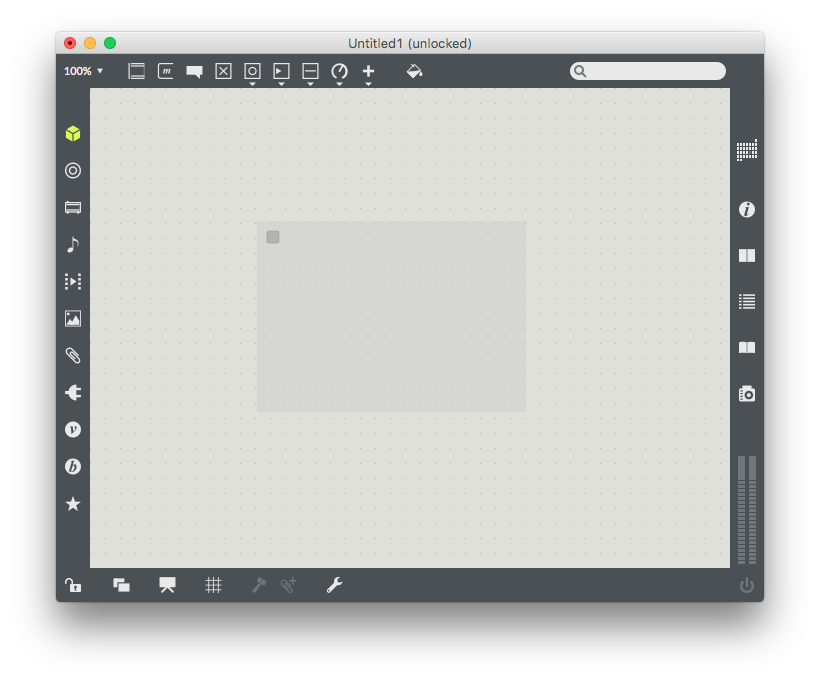
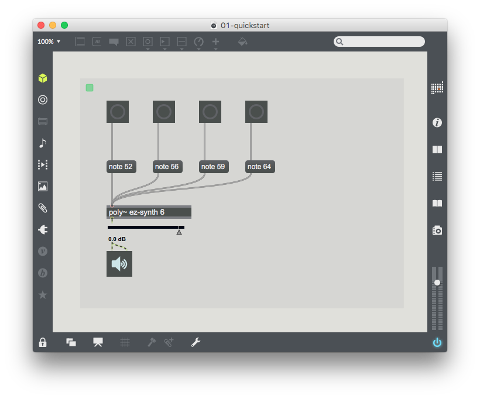

Xebra provides a direct interface to user interface elements in a remote instance of Max. Through a simple Javascript API, it's possible to connect to a Max patch, listen for changes, and to manipulate the value of certain objects.

### The Max Patch

In this guide, we'll make a simple webpage with an HTML button for each Max button in the connected patch. To start with, open up Max and create a new patcher. Then, press the 'n' key and type 'mira.frame' to create a mira.frame object. In order for a patcher to expose its content to Xebra, it must contain at least one mira.frame object.



### The Webpage

Let's make a simple webpage to display all of the buttons contained in the Max patcher. To start, make a blank webpage with a container div:

```html
<!-- index.html -->
<!DOCTYPE html>
<html>
<head>
	<title>Xebra Tutorial 01 - Quick Start</title>
</head>
<body>
		<div id="container">
		</div>
</body>
</html>
```
Now we need to include the xebra-state.js file, which has everything we need to connect to Max. Assuming the javascript file is in the same directory as the .html file, add the following `script` tag before the closing `body` tag to include the xebra-state.js file.

```html
<script type="text/javascript" src="./xebra-state.js"></script>
```
Finally, let's add some space to write our own simple script. All this script will do is create a new `<button>` element and add it to our webpage whenever a new `button` object is created in Max.

### Connecting to Max

Add the following script to the `index.html` file, before the closing `body` tag but after the `script` tag that includes `xebra-state.js`:

```html
<script type="text/javascript">
	var xebraState;
</script>
```

All we've done here is create a variable to store our `Xebra State` object, which will represent our connection to a remote instance of Max. In order to create that object, we need to pass a dictionary of configuration options.

```html
<script type="text/javascript">
	var xebraState;
	var options = {
		hostname: "127.0.0.1",
		port: 8086,
		supported_objects: ["button"]
	};
	xebraState = new Xebra.State(options);
</script>
```
In this object, `hostname` and `port` should be the ip address and port number of the Max patch to which we're trying to connect. In this case, Max is running on the same machine as the webpage, so we use `127.0.0.1`. Max listens for incoming Xebra connections on port 8086, so `port` should be left at that default value. After creating the `options` object, we create a new `XebraState` object, passing `options` as an argument.

Next, we need to listen to events from the `xebraState` object so that we can do something when the Max patch adds or removes a button.

```html
<script type="text/javascript">
	...
	xebraState = new Xebra.State(options);

	// Do something when a button gets added to the Max patcher
	xebraState.on("object_added", function(object) {
		if (object.type === "button") addHTMLButton(object);
	});

	// Do something when a button is removed
	xebraState.on("object_removed", function(object) {
		if (object.type === "button") removeHTMLButton(object);
	});

</script>
```

The functions `addHTMLButton` and `removeHTMLButton` are functions that we're about to write, which will add and remove HTML buttons to match our Max button. The `on` function attaches an event listener to `xebraState`. Whenever it emits an "object_added" event, it will now call the function associated with that event, passing as an argument the object that was added. This object is an instance of {@link XebraObjectNode} that represents an object in the Max patcher. It has a property `type` which will be the class name of the object in Max.

Now, let's write the functions `addHTMLButton` and `removeHTMLButton`

```html
<script type="text/javascript">
	...
	function addHTMLButton(object) {
		var newButton = document.createElement("button");
		newButton.id = "button-" + object.id;
		newButton.onmousedown = function() {
			object.setParamValue("value", 1);
		};
		newButton.onmouseup = function() {
			object.setParamValue("value", 0);
		};
		newButton.appendChild(document.createTextNode("Button " + object.id));
		document.getElementById("container").appendChild(newButton);
	}

	function removeHTMLButton(object) {
		var button = document.getElementById("button-" + object.id);
		button.parentNode.removeChild(button);
	}
</script>
```
Each object has a property `id`, which is a unique number associated with each Max object. When we create a new `<button>`, we assign it an id by concatenating the prefix "button-" with the `id` property of the {@link XebraObjectNode}. After that, we bind a function to `onmousedown` with sets the value of the parameter named "value" to 1. The `setParamValue` function of a {@link XebraObjectNode} allows us to set the value of a parameter on that object. This is the main way that we can communicate with the linked Max patcher. When we call `setParamValue`, Xebra will automatically set the value of that parameter in Max. For a `button` object, the "value" parameter determines whether the button is pressed or unpressed. Setting the "value" of a `button` to 1 presses the button and causes it to output a bang.

We're almost done. The last thing to do is to call `connect` on `xebraState` to make the connection to the Max patch.

```html
<script type="text/javascript">
	...
	xebraState.connect();
</script>
```

The full contents of `index.html` should look like this:

```html
<!DOCTYPE html>
<html>
<head>
	<title>Xebra Tutorial 01 - Quick Start</title>
</head>
<body>
		<div id="container">
		</div>
		<script type="text/javascript" src="./xebra-state.js"></script>
		<script type="text/javascript">

			var options = {
				hostname : "127.0.0.1", // localhost
				port : 8086,
				supported_objects : ["button"]
			};

			var xebraState = new Xebra.State(options);

			// Do something when a button gets added to the Max patcher
			xebraState.on("object_added", function(object) {
				if (object.type === "button") addHTMLButton(object);
			});

			// Do something when a button is removed
			xebraState.on("object_removed", function(object) {
				if (object.type === "button") removeHTMLButton(object);
			});

			function addHTMLButton(object) {
				var newButton = document.createElement("button");
				newButton.id = "button-" + object.id;
				newButton.onmousedown = function() {
					object.setParamValue("value", 1);
				};
				newButton.onmouseup = function() {
					object.setParamValue("value", 0);
				};
				newButton.appendChild(document.createTextNode("Button " + object.id));
				document.getElementById("container").appendChild(newButton);
			}

			function removeHTMLButton(object) {
				var button = document.getElementById("button-" + object.id);
				button.parentNode.removeChild(button);
			}

			xebraState.connect();

		</script>
</body>
</html>
```

Having come this far, why not enjoy a little fanfare? Try creating the following patch:


