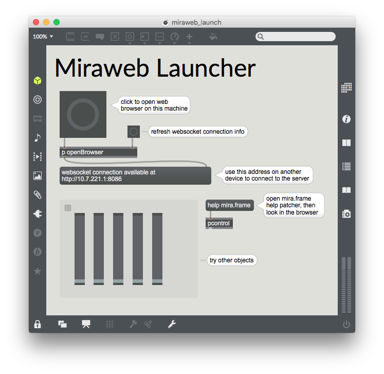

### Hostname and Port

Xebra connects to Max using a websocket connection. Max opens this connection as soon as a `mira.frame` object is created in any Max patcher. When such an object is created, Max will print the port number in the console. By default, this number will be 8086.


Use this port number in the browser, when connecting to Max using the Xebra library.

```
<script type="text/javascript" src="./xebra.js"></script>
<script type="text/javascript">

	var options = {
		hostname : "127.0.0.1", // localhost
		port : 8086
	};
	var xebraState = new Xebra.State(options);
</script>
```

When Max opens this websocket connection, it also creates a HTTP server on the same port, serving the Miraweb application. If you open a web browser and connect to Max using the same port, you can use the Miraweb app.


To connect to Max from anywhere other than the host machine, you will need to get your IP address. If Java is installed on your computer, you can use the `miraweb_launch` extra to find the externally available link to your websocket.




If Java is not installed on your machine, you'll have to find your IP address another way. Once you've got the IP address, you can use it to connect to Max from a machine other than the host machine.

```
<script type="text/javascript" src="./xebra.js"></script>
<script type="text/javascript">

	var options = {
		hostname : "10.7.221.1", // host machine ip address
		port : 8086
	};
	var xebraState = new Xebra.State(options);
</script>
```

### Connection States

Once you've created a new instances of Xebra.State, you can call `connect` to attempt a connection to the remote instance of Max.

```
var xebraState = new Xebra.State(options);
xebraState.connect();
```

As Xebra.State tries to connect to Max, it will emit "connection_changed" events every time the connection state changes. You can listen to these events to be notified of when the connection succeeds, is resolving, fails or closes.

```
xebraState.on("connection_changed", function (status) {
	console.log("Connection status:", status);
});
```

See {@link Xebra.CONNECTION_STATES} for each of the connection states and their meanings.